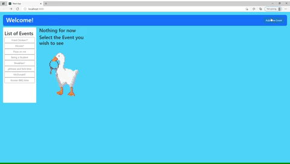
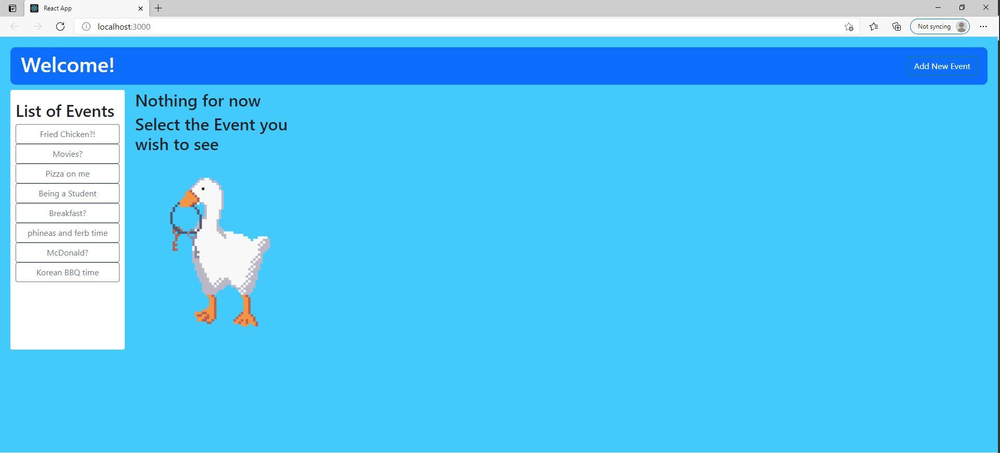
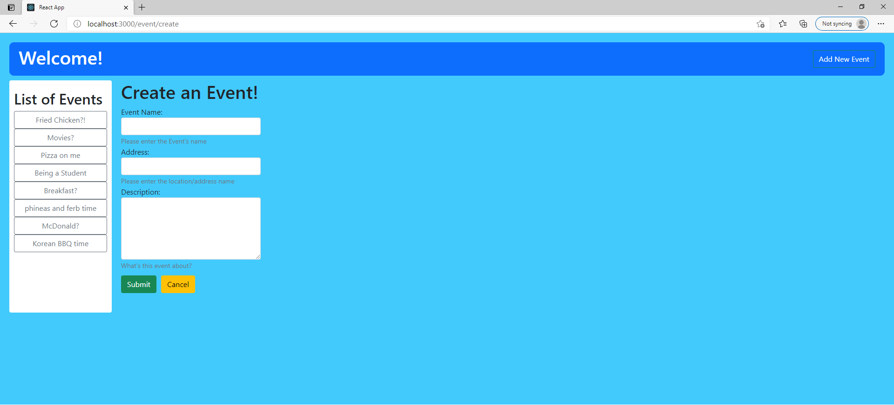
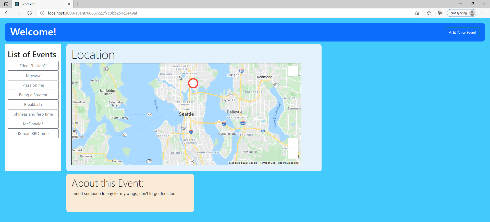

<br/>
<p align="center">
  <h3 align="center">Event Planner</h3>
  <p align="center">With Google Map</p>
</p>

Creating web application that uses Google Map 

## About this Project
Welcome to simple Event Planner web that uses Google Map!
<br/>


Playing with MERN I wanted to add API into the website. I created a simple web application where User can add an event with address, and it will display the location with a map using Google Map API.
I think this is a great way to practice applying api into MERN project, specifically calling within React. Thank you for checking out this page.

### Main Page


This is the Main page where user can see all the event that other users have shared.

* Button on the top right where users can register new event.
* Selection box on the left where users can select to view the event with more information.

### Create Page


Here is the Create page where user can register a new event by providing more information.

* Validation is built in from the back-end, each input must have required minimum number of character, and All input must be provided.
* Address will be use for displaying the location of the event using Google Maps API

### Details


When a user select the event from the side bar from the main page. They can see the title, description, and the location of the event through Google Maps.

### Built with
* MongoDB
* Express
* React
* Node.js
* Google Maps API
* HTML/CSS
* Bootstrap

## Getting Started
Starting out the project is simple, install Front-end (React) application (I named the app name "client")
```
npx create-react-app Your-app-name
```
this will create a folder with the name "Your-app-name"
and now create Back-end folder (I named the folder "server", there are many steps)

(Little side not, aquire a google map api through https://developers.google.com/maps)

## Contact / About Me
Jin Kim - [Github](https://github.com/kimjin-012) - [LinkedIn](https://www.linkedin.com/in/jin-kim-code/)
